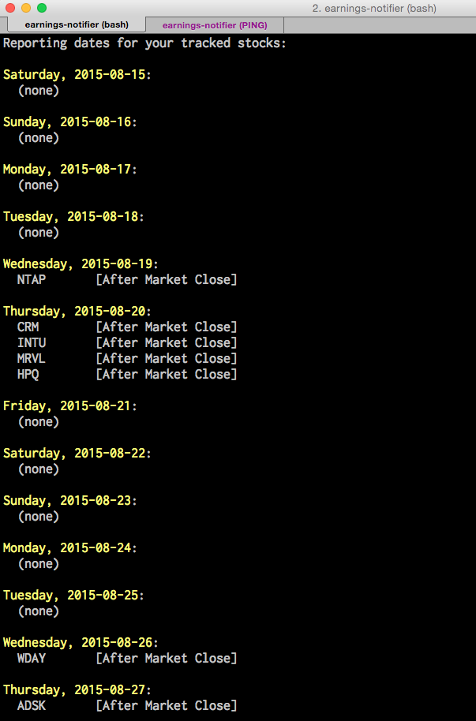

# Earnings Notifier / Calendar

Date authored: July 28, 2015

A program to show you upcoming announced earnings dates for stocks on your watchlist

- Uses http://biz.yahoo.com/research/earncal/ as its data source
<br><br>



Example stock_list.txt JSON file (same format as jshoe/stock_portfolio_manager):

```json
[
  {
    "symbol":"AAPL",
    "symbol":"MSFT"
  }
]
```
